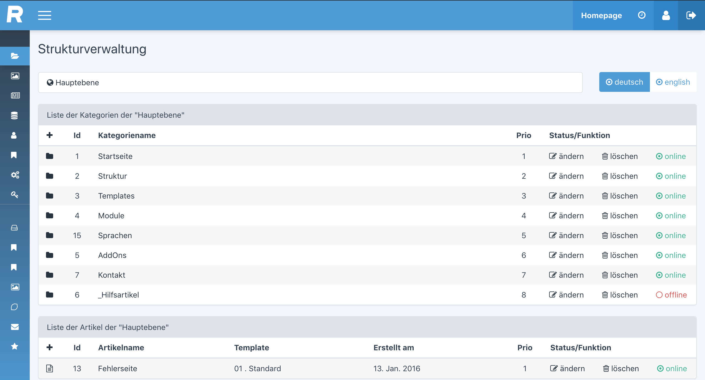

# Redaxo Backend Theme



Ein Plugin für das Redaxo AddOn `be_style`

## Installation

In den Plguins Ordner von `be_style`

```sh
cd redaxo/src/addons/be_style/plugins
```

`be_theme` klonen..
```sh
git clone ...
```

In der `package.yml` den SASS-Compiler aktivieren
```yaml
compile: 1
```

Falls notwendig, das Plugin noch auf den Server hochladen